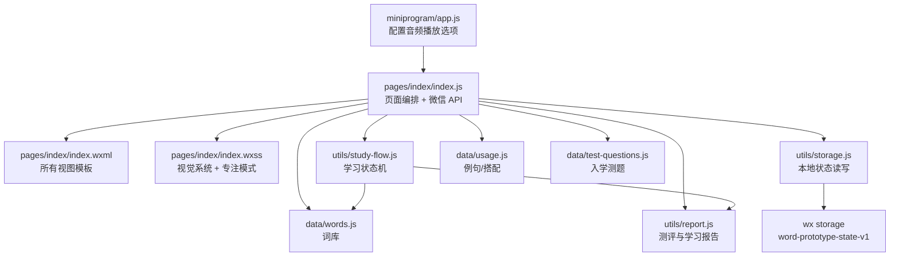
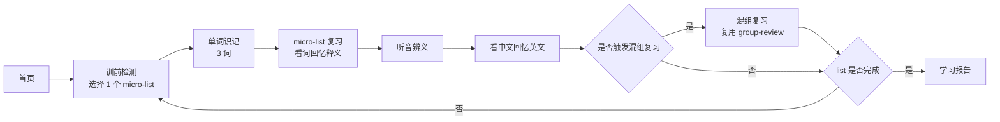
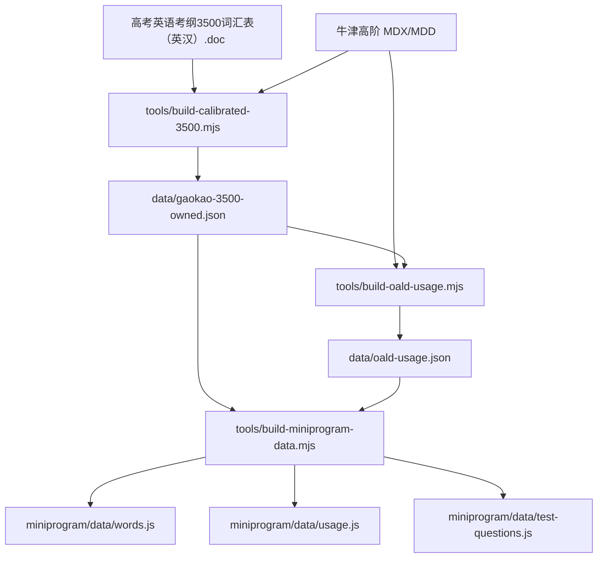
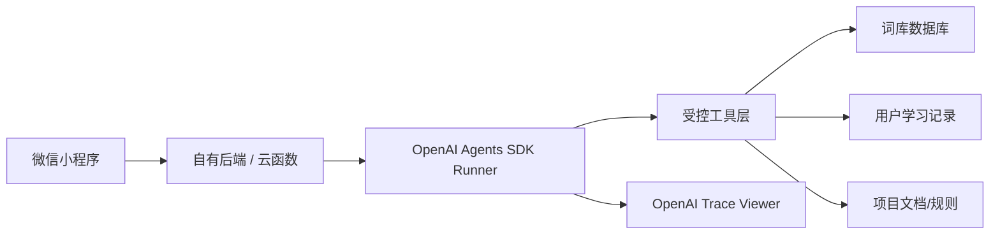

# 项目文档与代码架构梳理

日期：2026-05-31

## 结论

当前项目是一个以微信小程序为主的学生端背单词产品。代码已经从 Web 原型收敛为小程序单入口工程，核心架构可以分成五层：

1. 产品机制文档层：定义学习法、页面原则、词库口径和交互契约。
2. 小程序页面层：承载所有页面渲染、微信 API、音频与跟读检测。
3. 学习状态机层：承载 micro-list 学习流程、复习、混组复习、入学测和错词记录。
4. 数据构建层：把主词源、牛津用法、测试题压缩生成小程序可用数据。
5. 测试与审计层：用脚本守住数据、流程、UI 契约和按钮路径。

OpenAI Agents SDK 更适合放在后端或本地工具层，用来做“项目巡检、文档更新、学习报告、AI 阅读生成、错词分析”等非主心流任务；不建议直接放进小程序端，也不建议打断单词识记主流程。

## 当前目录分工

| 路径 | 角色 | 说明 |
| --- | --- | --- |
| `miniprogram/` | 小程序源码 | 微信开发者工具实际加载的工程根目录 |
| `miniprogram/pages/index/` | 单页应用主页面 | 所有视图都集中在 `index.js / index.wxml / index.wxss` |
| `miniprogram/utils/` | 业务逻辑工具 | 学习状态机、状态存储、报告计算 |
| `miniprogram/data/` | 小程序打包数据 | 由 `tools/build-miniprogram-data.mjs` 生成 |
| `data/` | 源数据与中间产物 | 3500 自有词库、用法数据、校准报告 |
| `data_sources/` | 外部源材料 | 课标 PDF、ECDICT 等历史/参考源 |
| `tools/` | 数据构建与审计脚本 | 生成词库、用法、交互审计、缺口报告 |
| `tests/` | 回归测试 | 数据、流程、UI 结构、交互契约测试 |
| `docs/` | 产品与架构文档 | 机制、设计原则、交互审计、词源校准 |
| `deploy/` | 部署配置 | 当前保留 nginx 配置，主工程仍是小程序 |

## 文档体系

### 产品主线文档

| 文档 | 当前作用 |
| --- | --- |
| `docs/product-mechanism-v2.md` | 当前产品机制主文档。定义“完成一本单词书”为 V2 首要目标，并规定 micro-list、list、group、复习、错词本、首页、我的等机制。 |
| `docs/focus-design-guide.md` | 当前学习页体验主文档。定义一屏一件事、渐进揭示、隐藏复杂度、学习页无导航、深色专注模式等规则。 |
| `docs/product-mechanism-v1.md` | 历史机制文档。保留早期艾宾浩斯和错词队列讨论，不再作为默认主逻辑。 |
| `docs/优化点讨论` | 苏格拉底讨论沉淀，包含 V2 部分需求来源。 |

### 数据与质量文档

| 文档 | 当前作用 |
| --- | --- |
| `docs/word-source-calibration-3500.md` | 3500 自有词库生成口径。主 DOC 优先，牛津 MDX 补词性、音标、例句和搭配。 |
| `docs/local-pdf-gap-review.md` | 本地词源缺口复核报告。 |
| `docs/interaction-audit.md` | 由 `tools/audit-mini-interactions.mjs` 自动生成，记录按钮路径和关键交互契约。 |
| `docs/feature-issue-audit.md` | 功能问题审计记录。 |

### 设计文档

| 文档 | 当前作用 |
| --- | --- |
| `docs/product-design-plan.md` | 较早的页面设计方案。 |
| `docs/focus-design-principles.svg` | 专注设计原则图。 |
| `docs/feature-issue-map.svg` | 功能问题关系图。 |

## 小程序运行架构



## 页面视图清单

`miniprogram/pages/index/index.js` 里的 `VIEWS` 是当前页面系统的源头：

| View | 页面 | 主要职责 |
| --- | --- | --- |
| `home` | 首页 | 显示下一步任务、当前词书、今日进度、入口。 |
| `profile` | 我的 | 展示个人进展，设置每日目标、播放循环、学习页主题，进入水平选择、词汇量测试、错词本。 |
| `month-progress` | 月度进展 | 展示按月打卡、已学单词和完成组数。 |
| `level-select` | 选择单词水平 | 当前只开放高中，其余水平灰置。 |
| `test` | 入学测 | 36 题两段式词汇量评估。 |
| `test-result` | 测评结果 | 输出词汇量区间、起点建议、分层表现。 |
| `precheck` | 训前检测 | 从 9 个候选词中选择 3 个不熟词进入学习。 |
| `word-study` | 单词识记 | 专注模式，自动发音循环，学生点击“记住了”。 |
| `group-review` | 本组/混组复习 | 看英文回忆中文，播放后揭示释义。混组复习复用同一页面。 |
| `audio-meaning` | 听音辨义 | 不展示英文，听发音回忆中文，2 秒后揭示。 |
| `meaning-recall` | 看中文回忆英文 | 只展示中文释义，2 秒后揭示英文。 |
| `wrong-book` | 错词本 | 展示待巩固词，支持点空白查看词卡、播放发音。 |
| `daily-report` | 学习报告 | list 完成后的报告和奖励节点。 |

## 核心状态机

### 主学习流程



### 混组复习节奏（目标机制，代码待同步）

产品目标机制定义如下。当前代码里的 `study-flow.js/enqueueMixedReviewsAfterGroup` 仍使用旧的“每 3 组为大 group”实现，后续需要按本节同步。

| 完成进度 | 触发 |
| --- | --- |
| list 内第 1 个 micro-list | 不触发混组，只做本组复习、听音辨义、中文回忆英文。 |
| list 内第 2 个 micro-list | 触发 `第1个 micro-list + 第2个 micro-list` 混组复习。 |
| list 内第 3 个 micro-list | 触发 `第1个 micro-list + 第2个 micro-list + 第3个 micro-list` 混组复习一次。 |
| 两个 list 都完成 | 触发 `List A + List B` 的 group 内复习。 |

## 状态结构

`miniprogram/utils/storage.js` 的 `defaultState` 是状态结构源头。

| 字段 | 说明 |
| --- | --- |
| `user` | 用户配置、词书、打卡、徽章、入学测结果。 |
| `user.settings.listGroupCount` | 旧字段：当前代码仍用它表示每日目标组数；目标机制中应迁移为“每日目标 list 数”。 |
| `user.settings.pronunciationLoopCount` | 单词识记播放循环次数，默认 3。 |
| `user.settings.learningTheme` | 学习页主题，默认 `dark`。 |
| `assessment` | 入学测当前题、答案、结果。 |
| `daily` | 今日学习中的所有流程状态。 |
| `daily.candidateWordIds` | 训前检测 9 个候选词。 |
| `daily.selectedWordIds` | 当前组 3 个词。 |
| `daily.completedGroups` | 当前 list 已完成的 micro-list。 |
| `daily.pendingMixedReviews` | 待执行的混组复习队列。 |
| `daily.reviewPhase` | `initial` 或 `mixed`，决定 `group-review` 当前语义。 |
| `userWordStates` | 每个学习项的熟悉度、错词、轮次掌握状态。 |
| `answerRecords` | 答题/自评记录，用于报告和错词统计。 |
| `lastReport` | 最近一次学习报告。 |

当前所有状态存在微信本地 storage 的 `word-prototype-state-v1`。测试号阶段够用；线上多用户必须迁移到云数据库或自有后端。

## 数据管线



### 当前词库口径

- 小程序打包的是 `gaokao_3500_owned` 自有词库。
- `tests/miniprogram-project.test.mjs` 明确禁止旧的 `moe_` 3000 词 ID 打进小程序包。
- `docs/word-source-calibration-3500.md` 记录当前核心学习版数量、需复核数量和生成口径。

## 测试与质量守护

`package.json` 的 `npm test` 串起了全部检查：

```text
test:data
→ test:3500
→ test:usage
→ test:report
→ test:flow
→ test:miniprogram
→ audit:interactions
```

| 测试 | 守护对象 |
| --- | --- |
| `tests/word-data.test.mjs` | 词库字段、释义、顺序、音标等基础数据。 |
| `tests/gaokao-3500-owned.test.mjs` | 自有 3500 词库质量。 |
| `tests/oald-usage.test.mjs` | 牛津用法、例句、搭配覆盖。 |
| `tests/reward-display.test.mjs` | 奖励、报告、展示数据。 |
| `tests/study-flow.test.mjs` | 入学测、训前检测、3 词一个 micro-list、混组复习、打卡等状态机。 |
| `tests/miniprogram-project.test.mjs` | 小程序配置、包体、页面结构、音频、专注模式 UI 契约。 |
| `tools/audit-mini-interactions.mjs` | 自动扫描 WXML 点击入口，并校验关键交互契约。 |

## 当前架构里的重要边界

### 小程序页面层做什么

- 维护当前 view。
- 调用 `study-flow.js` 修改业务状态。
- 调用 `storage.js` 保存状态。
- 构建各页面展示数据。
- 管理微信音频、录音、权限、播放重试。
- 控制专注页 2 秒揭示、3 秒超时、红边反馈、长按暂停。

### `study-flow.js` 做什么

- 入学测抽题与自适应追加。
- 训前检测候选词生成和补位。
- 3 词一个 micro-list 的学习推进。
- 本组复习、听音辨义、中文回忆英文、混组复习推进。
- 错词记录、重试题追加、轮次掌握状态。
- list 完成、打卡、group 内复习任务。

### `tools` 做什么

- 把授权/本地词源转换成产品自有词库。
- 从牛津词典抽取例句和搭配。
- 压缩数据到小程序包。
- 输出审计报告。

### 文档做什么

- `product-mechanism-v2.md` 定产品机制。
- `focus-design-guide.md` 定学习页体验原则。
- `word-source-calibration-3500.md` 定词源口径。
- `interaction-audit.md` 定当前点击路径结果。

## OpenAI Agents SDK 接入建议

### 不建议接入的位置

| 位置 | 原因 |
| --- | --- |
| 小程序端直接调用 OpenAI | API Key 会暴露，且微信端网络与鉴权不适合直接承载。 |
| `word-study` / `group-review` 主心流中实时请求 Agent | 会破坏“看到词 → 反应 → 下一个”的速度。 |
| 本地 storage 状态直接交给 Agent 改写 | 容易造成状态机不可复现，难以测试。 |

### 建议接入的位置

| Agent | 触发位置 | 工具 | 输出 |
| --- | --- | --- | --- |
| `ProjectArchitectureAgent` | 本地开发工具或 CI 手动触发 | 读取 docs、代码、测试、git diff | 更新架构文档、风险清单、变更摘要 |
| `VocabularyUsageAgent` | 数据构建阶段 | 查询词库、牛津用法、缺口报告 | 例句/搭配候选、需人工审核列表 |
| `LearningReportAgent` | 学习报告页或我的页 | 读取学习记录、错词、打卡 | 简短学习建议，不改变主流程 |
| `ReadingGeneratorAgent` | 我的页隐藏入口或未来阅读模块 | 读取已学词、词性、释义 | 阅读理解、完形填空、题目解析 |
| `WrongWordCoachAgent` | 错词本详情 | 读取单词、错误历史、用法 | 个性化记忆提示 |

### 推荐后端形态



### 工具边界

Agent 工具应该是“读多写少、写入可审计”：

| 工具 | 权限 |
| --- | --- |
| `get_word_item(wordId)` | 只读词库。 |
| `get_user_progress(userId)` | 只读学习进度。 |
| `get_wrong_words(userId)` | 只读错词。 |
| `generate_reading_task(wordIds, level)` | 生成内容，不直接入库。 |
| `propose_usage_patch(wordId)` | 只生成候选补丁，需人工审核后入库。 |
| `summarize_project_architecture()` | 只读项目文件，输出报告。 |

### 本项目最适合的第一版 Agent

优先做 `ProjectArchitectureAgent`，原因：

- 不影响小程序学习体验。
- 可以帮项目持续保持文档和代码一致。
- 可以把 `docs/product-mechanism-v2.md`、`docs/focus-design-guide.md`、`tests/*`、`miniprogram/pages/index/*` 的漂移自动找出来。
- 输出可以进入 `docs/feature-issue-audit.md` 或新的架构审计文档。

## ProjectArchitectureAgent 设计草案

### Agent 职责

```text
你是项目架构梳理 Agent。
你只读取项目文件，不直接修改业务代码。
你的任务是：
1. 梳理当前产品文档、代码、测试之间的一致性。
2. 标出已实现、未实现、文档与代码冲突的地方。
3. 输出面向开发者的架构摘要和风险清单。
```

### 建议工具

```text
list_files(pattern)
read_file(path)
search_repo(query)
run_allowed_check(command)
write_report(path, content)
```

### 允许命令

```text
npm test
npm run test:flow
npm run test:miniprogram
npm run audit:interactions
node --check miniprogram/pages/index/index.js
```

### 禁止事项

- 不上传测试版。
- 不改小程序源码。
- 不改词库源数据。
- 不删除文件。
- 不绕过测试失败。

## 后续维护规则

1. 改产品机制，先改 `docs/product-mechanism-v2.md`。
2. 改学习页体验，先改 `docs/focus-design-guide.md`。
3. 改词源和释义，必须同步 `docs/word-source-calibration-3500.md` 和数据测试。
4. 改主流程，必须同步 `tests/study-flow.test.mjs`。
5. 改 WXML 交互，必须同步 `tools/audit-mini-interactions.mjs` 的契约。
6. 每次提交前跑 `npm test`。
7. 上线前多用户数据必须从本地 storage 迁移到云数据库或自有后端。
